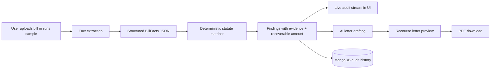
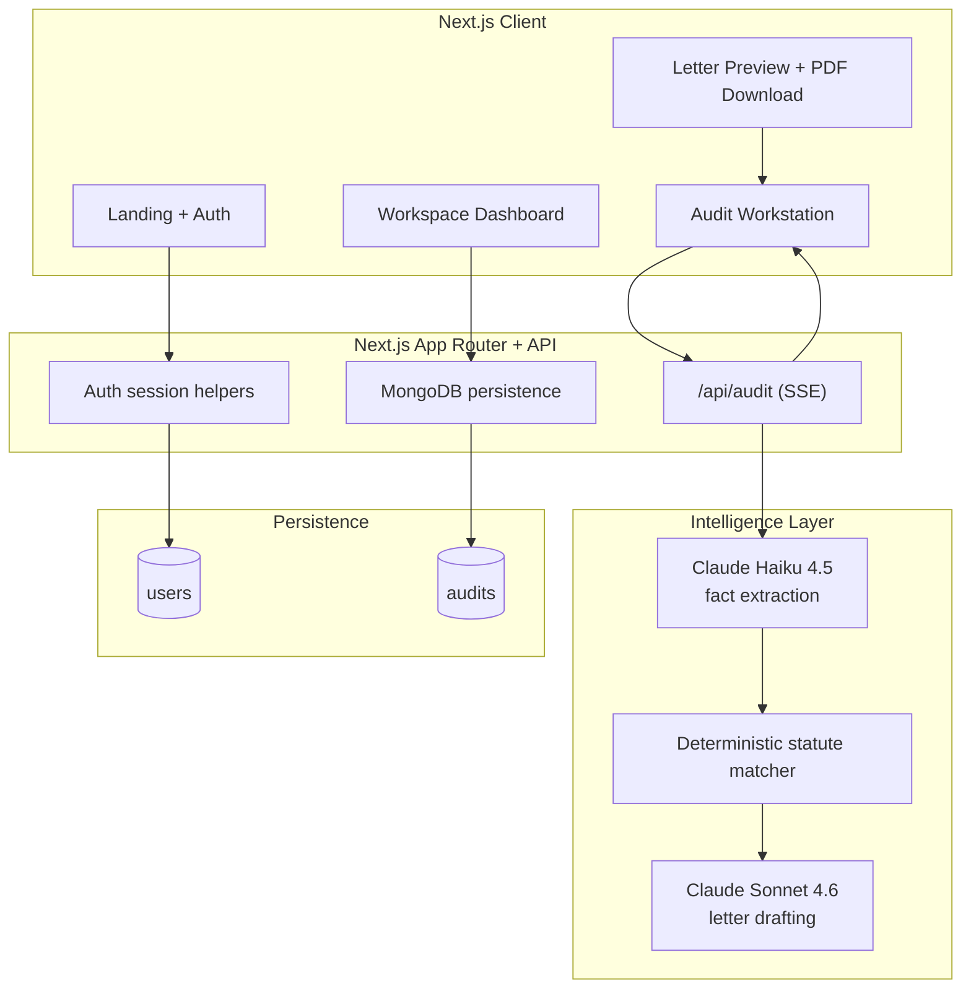
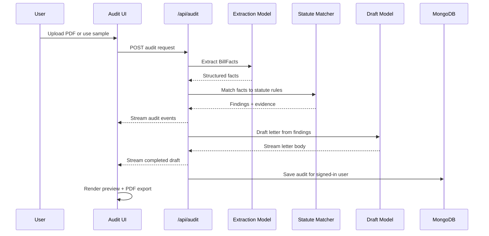

# Recourse

**You have recourse.**

Recourse turns confusing medical bills into statute-backed dispute letters in minutes. A user uploads a bill, Recourse extracts the facts, deterministically matches those facts against a verified statute library, streams the audit trail in real time, and generates a formal dispute letter ready to download as a PDF.

Built for people who need clarity, speed, and a credible path forward when a bill feels wrong.

## Why This Matters

Medical bills are hard to read, harder to challenge, and often time-sensitive. Most people do not know:

- what on the bill is suspicious
- which law might apply
- how to write a formal dispute that sounds credible

Recourse closes that gap by combining structured extraction, deterministic legal matching, and AI-assisted drafting into one user flow.

## What Recourse Does

- Uploads and parses US medical billing documents
- Extracts structured facts from PDFs using schema-constrained AI
- Matches findings against a verified statute/rule library
- Streams an audit trail so the user sees the reasoning before the letter
- Drafts a formal dispute letter grounded in matched citations
- Signs the Recourse document with the logged-in user's name
- Exports the final output as a polished PDF
- Saves audits, statute hits, and dashboard history for signed-in users

## Core Product Flow



## How The Audit Engine Works

Recourse deliberately separates factual extraction from legal matching:

1. `Extract`
   A PDF is sent to the extraction model, which must return a strict `BillFacts` object.
2. `Match`
   Recourse runs those facts against a hardcoded rule library. This step is deterministic, not LLM-judged.
3. `Stream`
   Findings are streamed into the UI as an audit trail so users can follow the reasoning.
4. `Draft`
   Only after findings exist does the drafting model generate the dispute letter body.
5. `Export`
   The final letter is rendered as a PDF with citations, account context, and the user's name.

## Why The Approach Is Different

- `Deterministic legal matching`: statutes are matched through code, not vibes
- `Traceable reasoning`: the user sees facts and citations before the final document
- `Human-centered UX`: the flow feels approachable even though the domain is intimidating
- `Actionable output`: the result is not just a summary, it is a sendable dispute letter

## Architecture



## Audit Lifecycle



## Features

### 1. Audit Workstation

The main product flow lives in `/workspace/audit`.

- drag-and-drop PDF upload
- sample Memorial Health bill for demos
- real-time server-sent audit events
- evidence panel with extracted bill facts
- live drafting state, clean-state, and rejection handling

### 2. Verified Statute Library

Users can browse a statute catalog with category filters and search.

- `NSA`
- `FDCPA`
- `ERISA`
- `HIPAA`
- `Reg E`

### 3. Signed-In Workspace

Authenticated users get:

- persistent audit history
- statute hit counts
- dashboard summaries
- saved profile and settings
- letters signed with their own name in Recourse outputs

### 4. Formal PDF Output

The exported letter includes:

- provider information
- date of service and account reference
- generated legal body
- citation footer
- user signature block

## Tech Stack

- `Next.js 16` with App Router
- `React 19`
- `TypeScript`
- `Tailwind CSS v4`
- `MongoDB`
- `Anthropic via AI SDK`
- `jsPDF`
- `motion`
- `jose` for session handling
- `bcryptjs` for password hashing

## Repository Structure

```text
Recourse/
├── README.md
├── CLAUDE.md
└── frontend/
    ├── app/
    │   ├── api/audit/route.ts
    │   ├── workspace/
    │   └── (auth)/
    ├── components/
    │   ├── workspace/
    │   ├── sections/
    │   └── primitives/
    ├── lib/
    │   ├── audit/
    │   ├── auth/
    │   └── db/
    └── public/
```

## Local Setup

From the `frontend/` directory:

```bash
npm install
npm run dev
```

Open `http://localhost:3000`.

## Environment Variables

Create `frontend/.env.local` with:

```bash
ANTHROPIC_API_KEY=your_anthropic_key
MONGO_URI=your_mongodb_connection_string
SESSION_SECRET=your_long_random_session_secret
```

Notes:

- `ANTHROPIC_API_KEY` is required for live PDF extraction and letter drafting
- `MONGO_URI` is required for user accounts, saved audits, and dashboard data
- `SESSION_SECRET` must be at least 32 characters
- the sample bill path can still demo parts of the experience if live extraction is unavailable

## Run Commands

From `frontend/`:

```bash
npm run dev
npm run build
npm start
npm run lint
```

## Demo Script Shortcut

The fastest end-to-end demo is:

1. Sign up or log in
2. Open `/workspace/audit`
3. Click `Try with the Memorial Health sample bill`
4. Let the audit stream complete
5. Show the findings and generated letter
6. Point out that the signed-in user's name appears in the Recourse document
7. Download the PDF
8. Open the dashboard and statute library to show persistence and product depth

## Current Rule Coverage

The matcher currently includes rules for:

- `NSA § 2799A-1`
- `NSA § 2799A-2`
- `NSA § 2799B-3`
- `FDCPA § 1692g`
- `FDCPA § 1692e`
- `HIPAA § 164.524`
- `CPT modifier 59` review logic

This is intentionally a narrow, high-confidence ruleset rather than a broad hallucinated legal surface.

## Design Principles

Recourse is built around three product principles:

- `Credibility`: institutional enough to earn trust in a legal-adjacent context
- `Clarity`: every important step is visible and understandable
- `Actionability`: the output should help the user do something real next

## Limitations

- currently optimized for US medical billing artifacts
- statute library is intentionally narrow and hardcoded
- no automated test runner is configured yet
- this is not legal advice and should not be presented as legal representation

## What We’d Build Next

- more billing-document coverage, including stronger EOB and denial-letter support
- deeper statute library expansion with versioned rules
- collaboration workflows for patient advocates and care navigators
- status tracking after a dispute letter is sent
- OCR and extraction hardening for low-quality scans

## Safety and Product Posture

Recourse does not pretend to replace a lawyer. It helps users understand possible billing violations, grounds those findings in explicit statutes, and produces a higher-quality starting point for dispute and escalation.

## Built For Hackathon Review

This project was designed to score well on:

- `Idea`: a concrete, painful real-world problem
- `Creativity`: combining deterministic legal matching with guided AI drafting
- `Build Quality`: full-stack auth, persistence, audit streaming, and PDF generation
- `User Experience`: polished, comprehensible, and demoable in minutes
- `Presentation`: clear narrative from upload to dispute-ready output
- `Impact`: a tool that can help real people challenge unfair medical bills

